<!-- docs/path-header/diagrams.md -->

# System Diagrams

This document contains Mermaid diagrams describing the architecture, workflow, and execution flow of Path Header Scanner.

---

# High-Level Architecture

## Mermaid

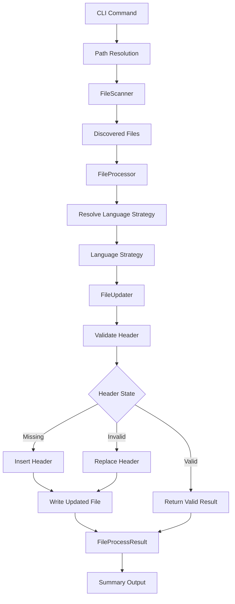

---

# CLI Flow

## Mermaid

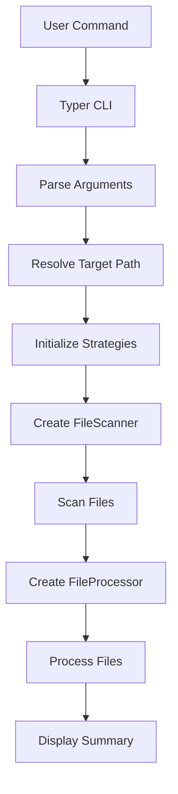

---

# Path Resolution Flow

## Mermaid

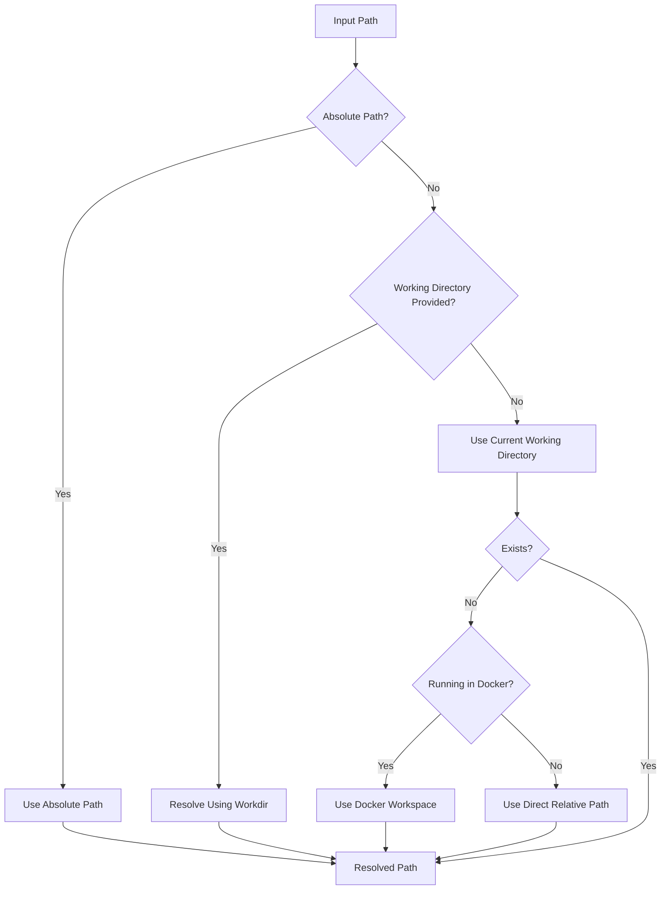

---

# Scanner Flow

## Mermaid

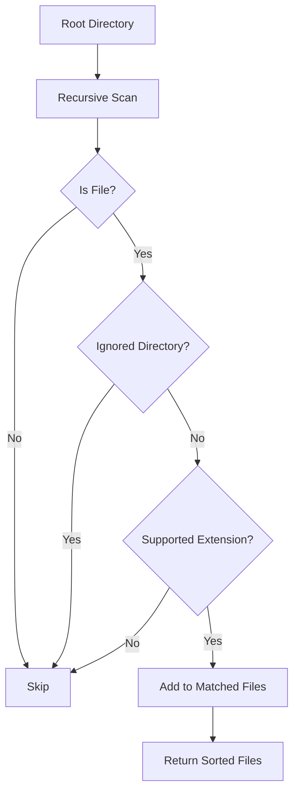

---

# Strategy Resolution Flow

## Mermaid

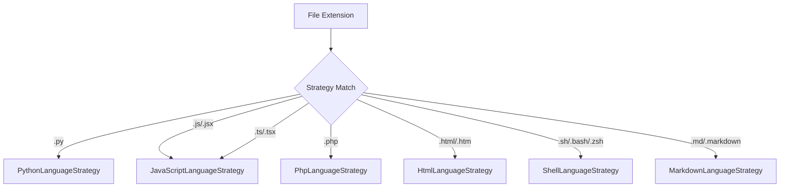

---

# File Processing Flow

## Mermaid

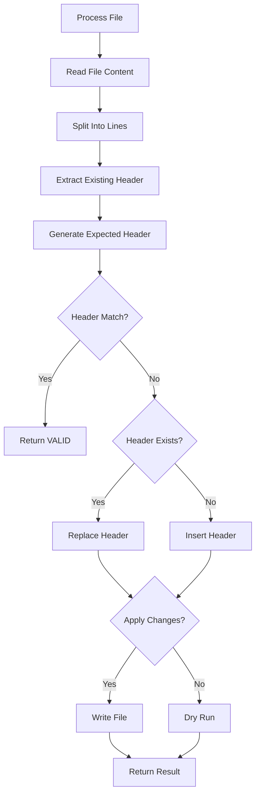

---

# Header Generation Flow

## Mermaid

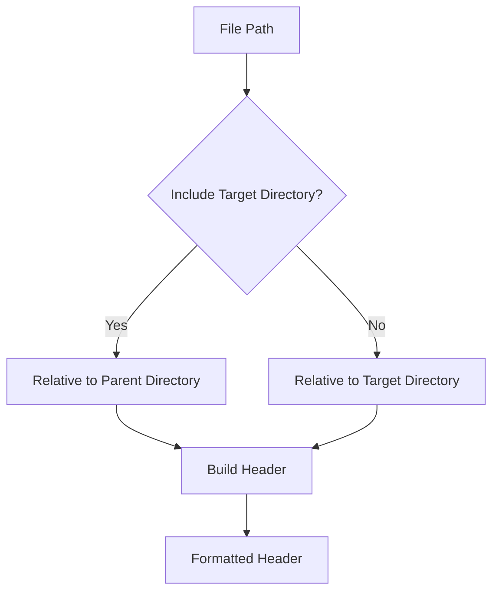

---

# Header State Decision Flow

## Mermaid

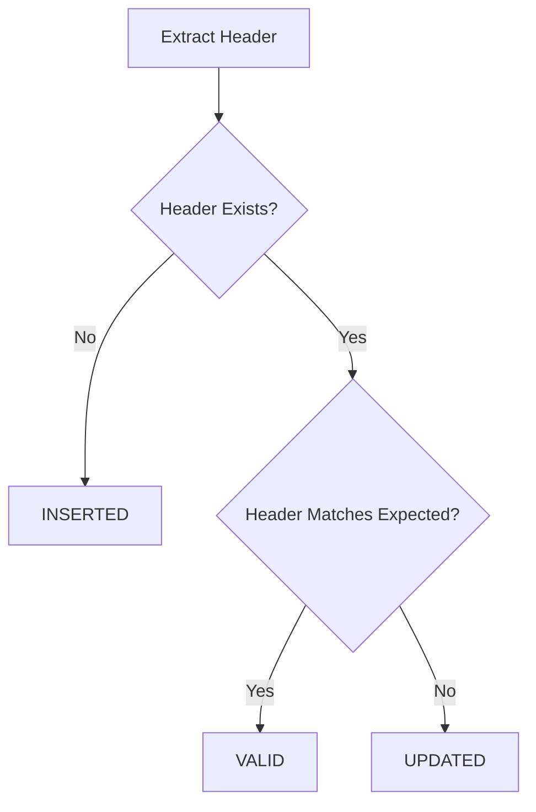

---

# Python Header Preservation Flow

## Mermaid

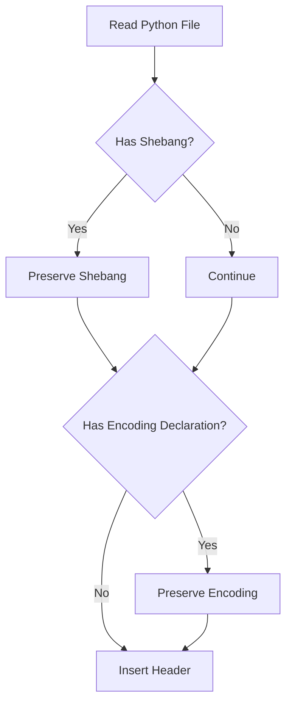

---

# PHP Header Preservation Flow

## Mermaid

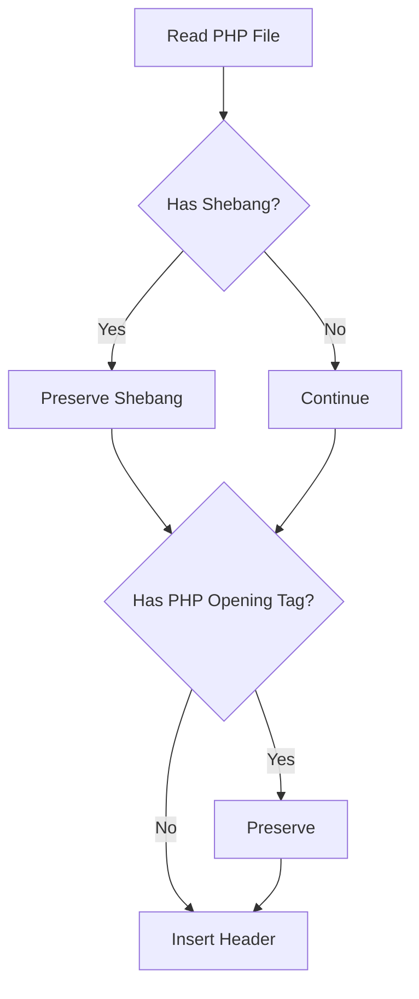

---

# Logging Flow

## Mermaid

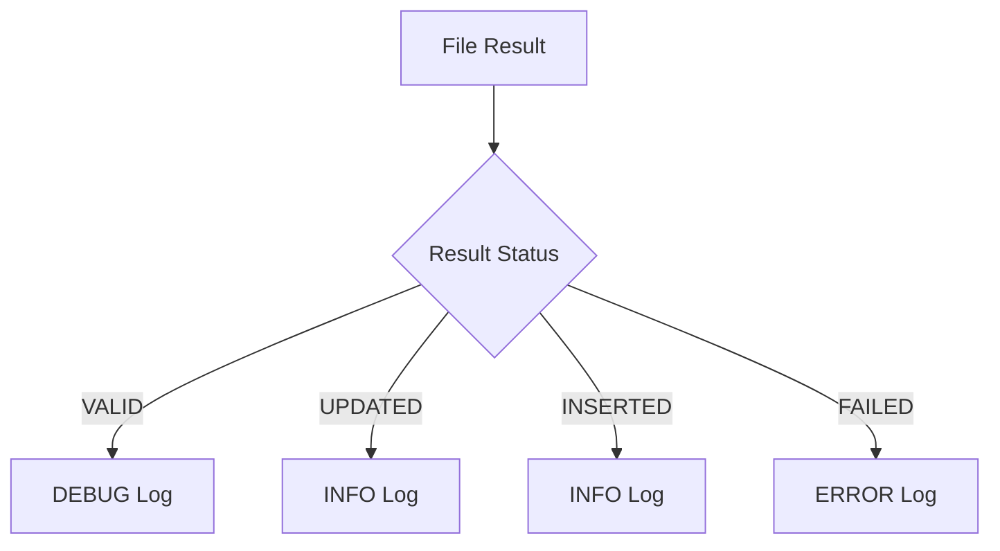

---

# Docker Workflow

## Mermaid

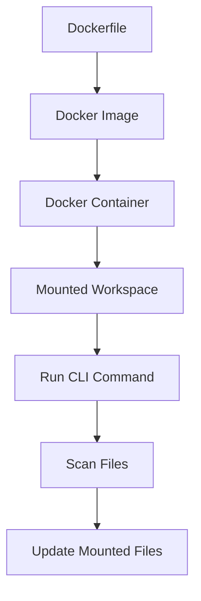

---

# Docker Compose Workflow

## Mermaid

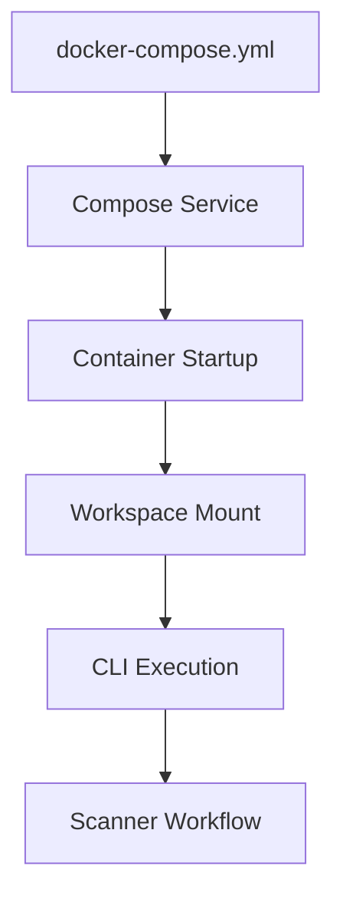

---

# Makefile Workflow

## Mermaid

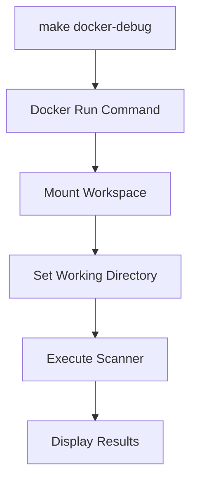

---

# Test Architecture

## Mermaid

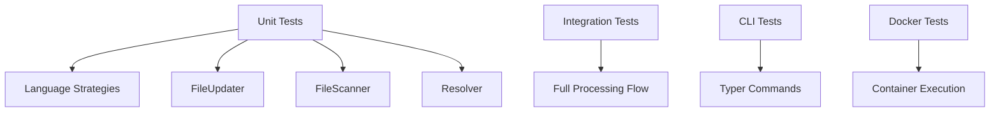

---

# Error Handling Flow

## Mermaid

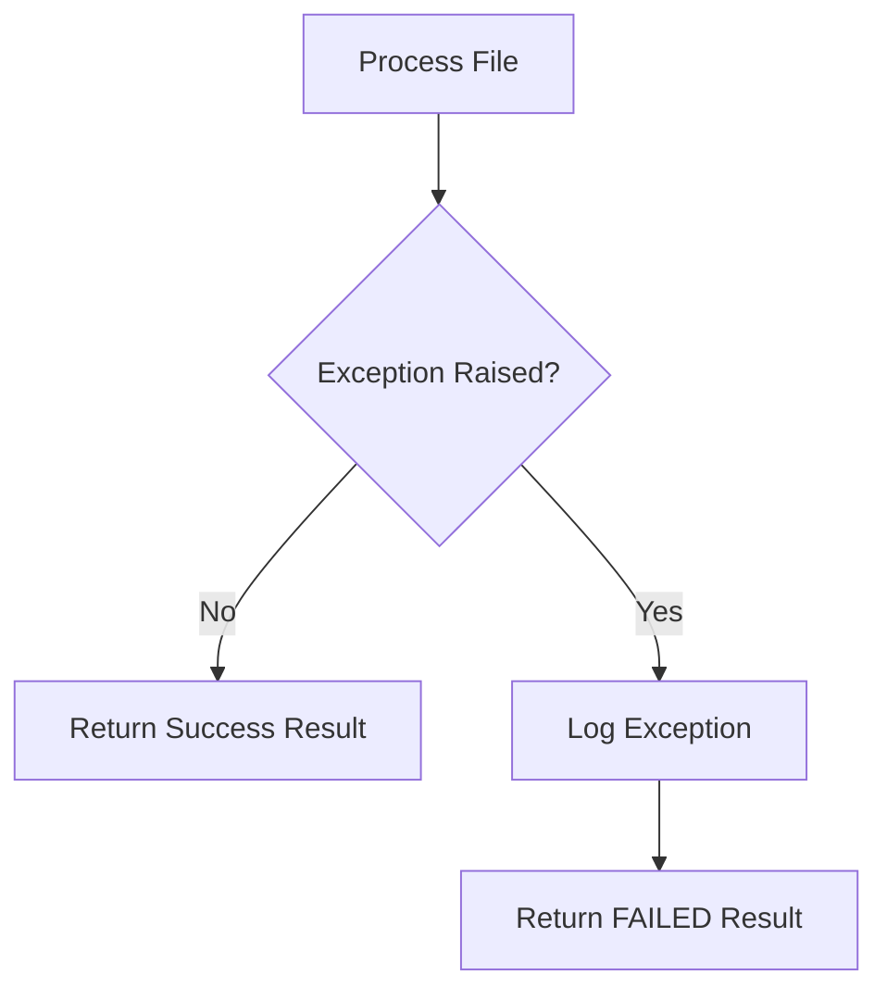

---

# Result Aggregation Flow

## Mermaid

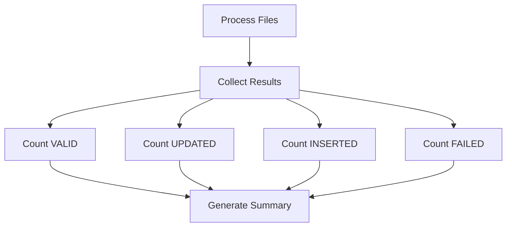

---

# Future Architecture Possibilities

## Mermaid

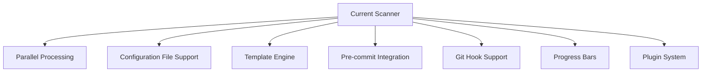

---

# Notes

- Diagrams use Mermaid syntax.
- Diagrams are intended for architecture visualization.
- Flows may evolve as the project grows.
- Diagrams are compatible with GitHub Markdown rendering.
