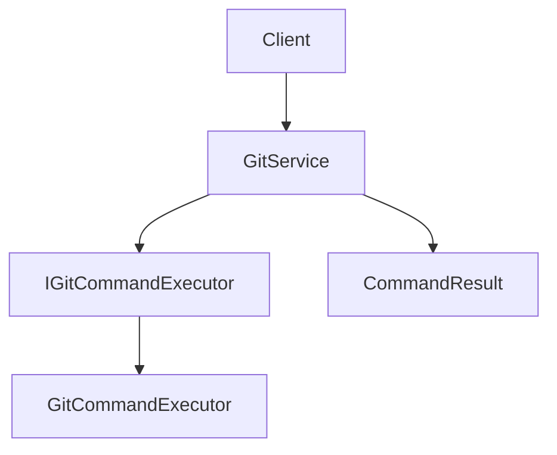

# docs/developer-guide/ai-development-workflow.md

# AI Development Workflow

## Overview

This document defines the recommended workflow for AI-assisted development within this project.

It applies to:

- ChatGPT
- Blackbox AI
- GitHub Copilot
- Cursor
- Claude
- Other AI coding assistants

The goal is to ensure that code changes remain:

- Maintainable
- Well documented
- Testable
- Observable
- Consistent with the project architecture

---

# Development Philosophy

When making changes:

1. Understand before modifying.
2. Prefer simple solutions over complex ones.
3. Keep functions and classes focused.
4. Add documentation alongside code.
5. Add tests for new functionality.
6. Add logging where it improves observability.
7. Document architectural changes before moving forward.

---

# Standard Development Lifecycle

Every feature, bug fix, refactor, or enhancement should follow the workflow below.

```text
Analysis
    ↓
Design
    ↓
Implementation
    ↓
Documentation
    ↓
Validation
```

---

# Phase 1: Analysis

## Goal

Understand the current implementation before making changes.

## Activities

- Review affected files
- Understand current behavior
- Identify limitations
- Identify dependencies
- Review existing documentation

## Deliverables

- Problem summary
- Impact assessment
- Required file list

## Questions

Before implementation, identify:

- Which files are affected?
- Which modules depend on them?
- Are additional files required?
- Is documentation already available?

---

# Phase 2: Design

## Goal

Define the solution before implementation.

## Activities

- Design architecture changes
- Define responsibilities
- Define interfaces
- Identify new files
- Identify modified files

## Deliverables

- Proposed architecture
- Component responsibilities
- File structure changes

## Design Principles

Prefer:

- Composition over inheritance
- Dependency injection
- Small focused classes
- Clear separation of responsibilities

Avoid:

- God classes
- Circular dependencies
- Excessive abstractions

---

# Phase 3: Implementation

## Goal

Implement the approved design.

## Activities

- Create or modify code
- Add type hints
- Add documentation
- Add logging
- Update configuration if needed

---

## Documentation Requirements

Every new file must contain:

- File-level documentation

Every new class must contain:

- Class documentation

Every new function must contain:

- Description
- Args
- Returns
- Raises

Recommended:

- Logic
- Notes
- Examples

---

## Preferred Function Format

```python
def process_file(path: Path) -> bool:
    """
    Process a file.

    Logic:
        Validate the file and update the header if necessary.

    Args:
        path (Path):
            File to process.

    Returns:
        bool:
            True if modified.

    Raises:
        FileNotFoundError:
            If the file does not exist.
    """
```

---

## Logging Requirements

Use logging whenever it improves troubleshooting or monitoring.

### CRITICAL

System cannot continue safely.

Examples:

- Corrupted state
- Fatal startup failure

### ERROR

Operation failed.

Examples:

- Command execution failure
- Validation failure

### WARNING

Recoverable issue.

Examples:

- Missing optional file
- Fallback behavior

### INFO

Important state changes.

Examples:

- Workflow started
- Workflow completed
- File updated

### DEBUG

Detailed execution flow.

Examples:

- Function entry
- Variable values
- Branch selection

---

# Phase 4: Documentation

## Goal

Keep documentation synchronized with implementation.

## Update Documentation When

- Adding commands
- Adding workflows
- Adding configuration options
- Adding architecture components
- Refactoring major modules
- Changing user-facing behavior

---

## Documentation Categories

### User Documentation

Location:

```text
docs/
```

Examples:

```text
installation.md
usage.md
configuration.md
```

---

### Developer Documentation

Location:

```text
docs/developer-guide/
```

Examples:

```text
development-workflow.md
troubleshooting.md
contributing.md
```

---

### Architecture Documentation

Location:

```text
docs/architecture/
```

Examples:

```text
overview.md
component-responsibilities.md
dependency-flow.md
design-patterns.md
```

---

# Architecture Refactor Workflow

Whenever a major refactor occurs:

Example:

Old:

```text
GitHelper
```

New:

```text
GitService
GitCommandExecutor
IGitCommandExecutor
CommandResult
create_git_service()
log_execution()
```

Documentation should be created before moving to the next feature.

Recommended files:

```text
docs/architecture/git/
├── overview.md
├── component-responsibilities.md
├── dependency-flow.md
├── design-patterns.md
└── diagrams.md
```

---

# Diagram Workflow

For significant architecture changes:

Create Mermaid diagrams.

Document:

- Component relationships
- Dependency flow
- Request flow
- Service interactions

Example:



Store diagrams under:

```text
docs/architecture/
```

---

# Phase 5: Validation

## Goal

Verify that the implementation is complete and correct.

## Validation Checklist

### Code

- Code compiles
- Type hints added
- Naming is consistent
- No placeholder code

### Testing

- Tests added
- Existing tests pass

### Logging

- Appropriate logging added
- Log levels used correctly

### Documentation

- Documentation updated
- Diagrams updated if required

### Architecture

- Responsibilities remain clear
- No unnecessary coupling introduced

---

# AI Assistant Expectations

When working on this project:

1. Confirm received files.
2. Summarize understanding.
3. Ask for missing files if required.
4. Avoid inventing missing code.
5. Avoid guessing project structure.
6. Explain architectural decisions.
7. Recommend documentation updates when appropriate.

---

# Final Response Format

After completing a task, provide:

## Changes Made

Summary of completed work.

## Why It Changed

Reasoning behind the changes.

## Files Modified

List of modified files.

## Documentation Updates

Recommended documentation updates.

## Next Step

Recommended next action.
